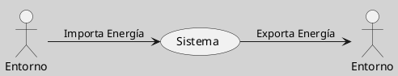

---
{"dg-publish":true,"permalink":"/050 Base de Conocimientos/200  Mi Zettelkasten/100 Docencia/Org1/2025/Clase 06 Sistemas, Fundamentos, Propiedades, Principios Básicos/Zk Sistemas (Intercambio de Energía)/","tags":["digitalGarden","corrienteEntrada","corrienteSalida"]}
---

## Sistemas (Intercambio de Energía)

El intercambio de energía en sistemas abiertos es un proceso fundamental que permite su funcionamiento y supervivencia. Este intercambio puede ocurrir a través de diversos mecanismos, como la fotosíntesis, donde las plantas convierten la energía solar en energía química, o mediante el flujo de calor y energía térmica.

**Figura**
_Intercambio de Energía entre el Sistema y su Entorno_

Nota: Elaboración propia

### Ejemplos

- **Fotosíntesis**: En los ecosistemas, la fotosíntesis es un ejemplo clásico de intercambio de energía. Las plantas capturan la energía solar y la convierten en energía química almacenada en moléculas orgánicas. Este proceso es esencial para el funcionamiento de los ecosistemas y para la vida en la Tierra. Según [Addiscott, T.M. (1995)](https://www.semanticscholar.org/paper/63eb7a54050f3a61208c781e12eea97c34fa71c7), la fotosíntesis es un proceso que reduce la [[050 Base de Conocimientos/200  Mi Zettelkasten/100 Docencia/Org1/2025/Clase 06 Sistemas, Fundamentos, Propiedades, Principios Básicos/Zk Entropía\|entropía]] al convertir pequeñas moléculas en estructuras más complejas y organizadas.

- **Flujo de Calor y Energía Térmica**: En sistemas físicos, el intercambio de energía térmica es común. Por ejemplo, un termo aislado puede transferir calor pero no materia, manteniendo el equilibrio térmico con su entorno.

- **Sistemas Económicos**: En sistemas económicos, la energía se intercambia en forma de trabajo, bienes y servicios. El comercio internacional y las inversiones extranjeras son ejemplos de cómo las economías intercambian energía en forma de valor económico. Esto está en línea con las ideas de [[050 Base de Conocimientos/900 Biblioteca/Zk Lit (García, 2024) Ciencias de la Complejidad - Teoría General de Sistemas, Pensamiento Sistémico y sus Aplicaciones Prácticas en las Ciencias Económicas, Ambientales y Sociales\|García (2024)]] sobre la importancia de los sistemas abiertos en la gestión de sistemas complejos.

## Importancia del Intercambio de Energía

El intercambio de energía es crucial para el funcionamiento de los sistemas abiertos. En sistemas biológicos, como plantas y animales, este intercambio es esencial para el metabolismo y la supervivencia. Según el artículo de [Dragičević, V., & Sredojević, S. (2011)](https://www.semanticscholar.org/paper/fe7c172360955393bd8d9339f0d0684cd2435359), los sistemas vivos transforman energía y materia durante el metabolismo, lo que incluye la pérdida de energía libre como calor, aumentando la entropía del entorno.
