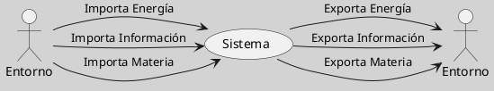

---
{"dg-publish":true,"permalink":"/050 Base de Conocimientos/200  Mi Zettelkasten/100 Docencia/Org1/2025/Clase 06 Sistemas, Fundamentos, Propiedades, Principios Básicos/Zk Sistemas Abiertos/","tags":["digitalGarden"]}
---

## Sistemas Abiertos

### Definición

Un sistema abierto es aquel que **intercambia** [[050 Base de Conocimientos/200  Mi Zettelkasten/100 Docencia/Org1/2025/Clase 06 Sistemas, Fundamentos, Propiedades, Principios Básicos/Zk Sistemas (Intercambio de Materia)\|materia]], [[050 Base de Conocimientos/200  Mi Zettelkasten/100 Docencia/Org1/2025/Clase 06 Sistemas, Fundamentos, Propiedades, Principios Básicos/Zk Sistemas (Intercambio de Energía)\|energía]] e [[050 Base de Conocimientos/200  Mi Zettelkasten/100 Docencia/Org1/2025/Clase 06 Sistemas, Fundamentos, Propiedades, Principios Básicos/Zk Sistemas (Intercambio de Información)\|información]] **con su entorno**. Estos sistemas son comunes en la naturaleza y en las organizaciones sociales y económicas. La teoría de sistemas abiertos proporciona una base para entender cómo estos sistemas mantienen su [[050 Base de Conocimientos/200  Mi Zettelkasten/100 Docencia/Org1/2025/Clase 06 Sistemas, Fundamentos, Propiedades, Principios Básicos/Zk Homeostasis\|homeostasis]] y evolucionan a través del tiempo. Según [[050 Base de Conocimientos/900 Biblioteca/Zk Lit (García, 2024) Ciencias de la Complejidad - Teoría General de Sistemas, Pensamiento Sistémico y sus Aplicaciones Prácticas en las Ciencias Económicas, Ambientales y Sociales\|García (2024)]], la importancia de los sistemas abiertos radica en su capacidad para interactuar con el entorno, lo cual es crucial para su supervivencia y evolución en contextos complejos.

**Figura**
_Sistemas Abiertos_

Nota: Elaboración propia

### Ejemplos

- **Ecosistemas Naturales**: Son ejemplos clásicos de sistemas abiertos. Intercambian materia y energía con su entorno a través de procesos como la fotosíntesis, la descomposición y el flujo de nutrientes. Estos sistemas dependen de la interacción con su entorno para mantener su equilibrio y biodiversidad.

- **Organizaciones Sociales**: Las comunidades o sociedades humanas son sistemas abiertos que intercambian información, recursos y personas con su entorno. La comunicación, el comercio y la migración son ejemplos de cómo estas organizaciones interactúan con otros sistemas sociales y ambientales.

- **Sistemas Económicos**: Las economías nacionales o globales son sistemas abiertos que intercambian bienes, servicios y capital con otros sistemas económicos. Esto se logra a través del comercio internacional, las inversiones extranjeras y los flujos financieros.

- **Sistemas de Comunicación**: Como las redes sociales o los medios de comunicación, son sistemas abiertos que intercambian información con su entorno. La información fluye entre los usuarios y el sistema, influenciando cómo se percibe y se interactúa con el mundo.

- **Sistemas Biológicos**: Los organismos vivos, como las células o los seres humanos, son sistemas abiertos que intercambian nutrientes, oxígeno y desechos con su entorno. Esta interacción es esencial para su supervivencia y funcionamiento.

### Importancia y Aplicaciones

La comprensión de los sistemas abiertos es crucial para gestionar sistemas complejos, como los económicos o ambientales. La teoría general de sistemas, desarrollada por [[050 Base de Conocimientos/900 Biblioteca/Zk Lit (von Bertalanffy, 1989) Teoría General de los Sistemas Fundamentos, Desarrollo, Aplicaciones\|von Bertalanffy (1989)]], proporciona una base para analizar estos sistemas. Además, [[050 Base de Conocimientos/200  Mi Zettelkasten/040 Teoría General de Sistemas (TGS)/Zk Lit (Ossa Ossa, 2016) Teoría General de Sistemas -  Conceptos y Aplicaciones\|Ossa Ossa (2016)]] destaca la importancia de considerar la interacción con el entorno en la gestión de sistemas abiertos.