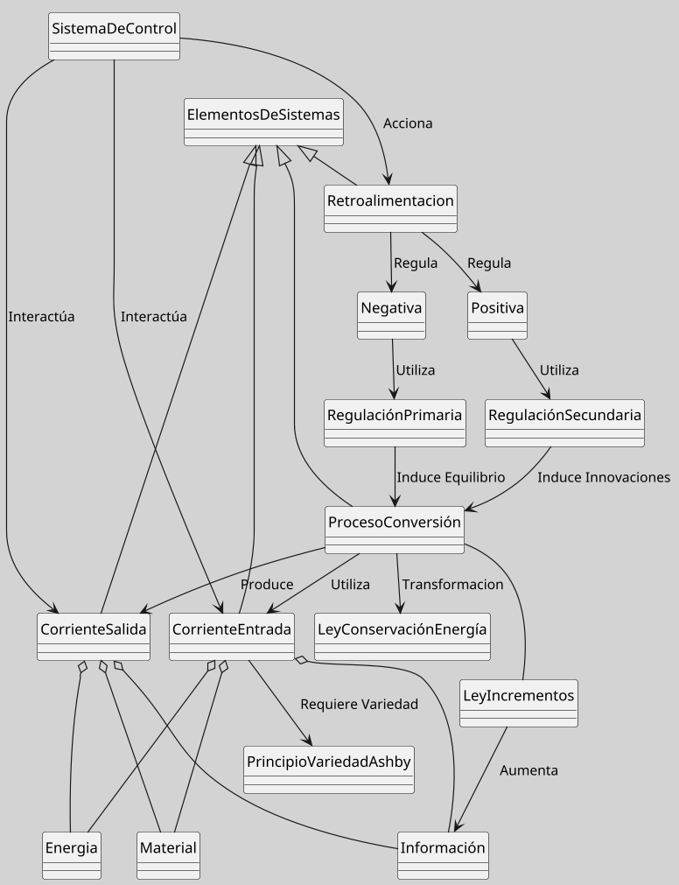

---
{"dg-publish":true,"permalink":"/050 Base de Conocimientos/200  Mi Zettelkasten/100 Docencia/Org1/2025/Clase 08 Elementos de un Sistema (Proceso de Conversión, Corriente de Salida, Mecanismos de Retroalimentación)/Zk !MOC Elementos de un Sistema 2 (Proceso de Conversión, Corriente de Salida, Retroalimentación, etc.)/","tags":["moc","sistema"]}
---

## MOC Elementos de un Sistema (Proceso de Conversión, Corriente de Salida, Retroalimentación, etc.)

### Introducción

La [[050 Base de Conocimientos/200  Mi Zettelkasten/100 Docencia/Org1/2025/Clase 07 Elementos de un Sistema (Corriente de Entrada)/Zk !MOC Elementos de un Sistema 1 (Corriente de Entrada)\|clase anterior]] comenzamos a explorar los [[050 Base de Conocimientos/200  Mi Zettelkasten/100 Docencia/Org1/2025/Clase 07 Elementos de un Sistema (Corriente de Entrada)/Zk Sistemas (Elementos)\|Elementos que componen un Sistema]], enfocándonos inicialmente en las [[050 Base de Conocimientos/200  Mi Zettelkasten/100 Docencia/Org1/2025/Clase 07 Elementos de un Sistema (Corriente de Entrada)/Zk Sistemas (Corrientes de Entrada)\|Corrientes de Entrada]].

<a class="markdown-embed-link" href="/050-base-de-conocimientos/200-mi-zettelkasten/100-docencia/org1/2025/clase-07-elementos-de-un-sistema-corriente-de-entrada/zk-sistemas-elementos/#0805b2" aria-label="Open link"><svg xmlns="http://www.w3.org/2000/svg" width="24" height="24" viewBox="0 0 24 24" fill="none" stroke="currentColor" stroke-width="2" stroke-linecap="round" stroke-linejoin="round" class="svg-icon lucide-link"><path d="M10 13a5 5 0 0 0 7.54.54l3-3a5 5 0 0 0-7.07-7.07l-1.72 1.71"></path><path d="M14 11a5 5 0 0 0-7.54-.54l-3 3a5 5 0 0 0 7.07 7.07l1.71-1.71"></path></svg></a>

**Figura**
_Elementos de un sistema, un Esquema Básico_
/000%20Adjuntos/Zk%20Sistemas%20(Elementos)-1.png)
Fuente:  A partir de las definiciones 

En este MOC, seguiremos avanzando en el análisis de los demás elementos de los sistemas.

----
### Desarrollo
Iniciamos el estudio analizando los [[050 Base de Conocimientos/200  Mi Zettelkasten/100 Docencia/Org1/2025/Clase 07 Elementos de un Sistema (Corriente de Entrada)/Zk Sistemas (Elementos)\|Elementos de un Sistema]] para construir una visión global que sirva de marco orientador.

1. [[050 Base de Conocimientos/200  Mi Zettelkasten/100 Docencia/Org1/2025/Clase 07 Elementos de un Sistema (Corriente de Entrada)/Zk Sistemas (Corrientes de Entrada)\|Corrientes de Entrada]]: Son determinantes para el funcionamiento y adaptabilidad de cualquier sistema. Estas corrientes pueden ser de recursos, información o energía.
    
2. [[050 Base de Conocimientos/200  Mi Zettelkasten/100 Docencia/Org1/2025/Clase 08 Elementos de un Sistema (Proceso de Conversión, Corriente de Salida, Mecanismos de Retroalimentación)/Zk Sistemas (Proceso de Conversión)\|Proceso de Conversión]]: Es el mecanismo mediante el cual las corrientes de entrada se transforman en productos o servicios. Este proceso es crítico para el cumplimiento con el objetivo del sistema.
    
3. [[050 Base de Conocimientos/200  Mi Zettelkasten/100 Docencia/Org1/2025/Clase 08 Elementos de un Sistema (Proceso de Conversión, Corriente de Salida, Mecanismos de Retroalimentación)/Zk Sistemas (Corrientes de Salida)\|Corrientes de Salida]]: Resultado del proceso de conversión, pueden ser productos, servicios o información que el sistema ofrece a su entorno.
    
4. [[050 Base de Conocimientos/200  Mi Zettelkasten/100 Docencia/Org1/2025/Clase 08 Elementos de un Sistema (Proceso de Conversión, Corriente de Salida, Mecanismos de Retroalimentación)/Zk Sistemas (Mecanismos de Retroalimentación)\|Mecanismos de Retroalimentación]]:
    
    4.1 [[050 Base de Conocimientos/200  Mi Zettelkasten/100 Docencia/Org1/2025/Clase 08 Elementos de un Sistema (Proceso de Conversión, Corriente de Salida, Mecanismos de Retroalimentación)/Zk Sistemas (Mecanismos de Retroalimentación Negativa o Morfostasis)\|Retroalimentación Negativa (Morfostasis)]]: Ayuda a mantener la estabilidad del sistema al corregir desviaciones.
        
    4.2 [[050 Base de Conocimientos/200  Mi Zettelkasten/100 Docencia/Org1/2025/Clase 08 Elementos de un Sistema (Proceso de Conversión, Corriente de Salida, Mecanismos de Retroalimentación)/Zk Sistemas (Mecanismos de Retroalimentación Positiva o Morfogénesis)\|Retroalimentación Positiva (Morfogénesis)]]: Fomenta el crecimiento y el cambio al amplificar las desviaciones.

5. [[050 Base de Conocimientos/200  Mi Zettelkasten/100 Docencia/Org1/2025/Clase 08 Elementos de un Sistema (Proceso de Conversión, Corriente de Salida, Mecanismos de Retroalimentación)/Zk Sistemas (Sistemas de Control)\|Sistemas de Control]]: Son esenciales para mantener el [[050 Base de Conocimientos/200  Mi Zettelkasten/040 Teoría General de Sistemas (TGS)/Zk Sistemas Estables\|equilibrio]] y la eficiencia del sistema. Estos sistemas incluyen [[050 Base de Conocimientos/200  Mi Zettelkasten/100 Docencia/Org1/2025/Clase 08 Elementos de un Sistema (Proceso de Conversión, Corriente de Salida, Mecanismos de Retroalimentación)/Zk Sistemas (Sistemas de Control)#Componentes Básicos de un Sistema de Control\|sensores, controladores y actuadores]] que trabajan juntos para ajustar el rendimiento del sistema según sea necesario.

6. [[050 Base de Conocimientos/200  Mi Zettelkasten/100 Docencia/Org1/2025/Clase 08 Elementos de un Sistema (Proceso de Conversión, Corriente de Salida, Mecanismos de Retroalimentación)/Zk Sistemas (Estrategias de Integración)\|Estrategias de Integración]]: Los sistemas deben adquirir, comprar, negociar, etc., los recursos necesarios ([[050 Base de Conocimientos/200  Mi Zettelkasten/100 Docencia/Org1/2025/Clase 07 Elementos de un Sistema (Corriente de Entrada)/Zk Sistemas (Corrientes de Entrada)\|corrientes de entrada]]) para alcanzar sus objetivos mediante su [[050 Base de Conocimientos/200  Mi Zettelkasten/100 Docencia/Org1/2025/Clase 08 Elementos de un Sistema (Proceso de Conversión, Corriente de Salida, Mecanismos de Retroalimentación)/Zk Sistemas (Proceso de Conversión)\|proceso de conversión]]. En este contexto, es necesario considerar que los [[050 Base de Conocimientos/200  Mi Zettelkasten/100 Docencia/Org1/2025/Clase 07 Elementos de un Sistema (Corriente de Entrada)/Zk Sistemas (Corriente de Naturaleza Material)\|materiales]], la [[050 Base de Conocimientos/200  Mi Zettelkasten/100 Docencia/Org1/2025/Clase 07 Elementos de un Sistema (Corriente de Entrada)/Zk Sistemas (Corriente de Naturaleza Energética)\|energía]] o la [[050 Base de Conocimientos/200  Mi Zettelkasten/100 Docencia/Org1/2025/Clase 07 Elementos de un Sistema (Corriente de Entrada)/Zk Sistemas (Corriente de Naturaleza Informativa)\|información]] requeridas como [[050 Base de Conocimientos/200  Mi Zettelkasten/100 Docencia/Org1/2025/Clase 07 Elementos de un Sistema (Corriente de Entrada)/Zk Sistemas (Corrientes de Entrada)\|corrientes de entrada]] pueden ser escasos o de difícil obtención, lo que hace que su acceso sea competitivo o esté regido por las leyes del mercado.

>[!TIP] Las [[050 Base de Conocimientos/200  Mi Zettelkasten/100 Docencia/Org1/2025/Clase 08 Elementos de un Sistema (Proceso de Conversión, Corriente de Salida, Mecanismos de Retroalimentación)/Zk Sistemas (Estrategias de Integración)\|estrategias de integración]], tanto [[050 Base de Conocimientos/200  Mi Zettelkasten/100 Docencia/Org1/2025/Clase 08 Elementos de un Sistema (Proceso de Conversión, Corriente de Salida, Mecanismos de Retroalimentación)/Zk Sistemas (Estrategias de Integración Vertical)\|vertical]] como [[050 Base de Conocimientos/200  Mi Zettelkasten/100 Docencia/Org1/2025/Clase 08 Elementos de un Sistema (Proceso de Conversión, Corriente de Salida, Mecanismos de Retroalimentación)/Zk Sistemas (Estrategias de Integración Horizontal)\|horizontal]], emergen como mecanismos para facilitar la obtención de estos recursos.

7. Leyes y Principios: Las leyes y principios en sistemas constituyen **patrones universales** que gobiernan el comportamiento de sistemas complejos.

	7.1 [[050 Base de Conocimientos/200  Mi Zettelkasten/100 Docencia/Org1/2025/Clase 07 Elementos de un Sistema (Corriente de Entrada)/Zk Sistemas (Ley de la Conservación de la Energía)\|Ley de la Conservación de la Energía]]: Indica que la energía no se crea ni se destruye, solo se transforma.

	7.2 [[050 Base de Conocimientos/200  Mi Zettelkasten/100 Docencia/Org1/2025/Clase 07 Elementos de un Sistema (Corriente de Entrada)/Zk Sistemas (Principio de Variedad de Ashby)\|Principio de Variedad de Ashby]]: Sugiere que un sistema debe tener variedad para enfrentar la variedad del entorno.
	
	7.3 [[050 Base de Conocimientos/200  Mi Zettelkasten/100 Docencia/Org1/2025/Clase 07 Elementos de un Sistema (Corriente de Entrada)/Zk Sistemas (Ley de los Incrementos - Información)\|Ley de los Incrementos (Información)]]: Implica el crecimiento y desarrollo de los sistemas a través de la acumulación de información.
	
>[!Tip] [[050 Base de Conocimientos/200  Mi Zettelkasten/100 Docencia/Org1/2025/Clase 08 Elementos de un Sistema (Proceso de Conversión, Corriente de Salida, Mecanismos de Retroalimentación)/Zk Ley de la Conservación - Principio de Variedad de Ashby - Ley de los Incrementos (Información)\|Relación: Ley de la Conservación - Principio de Variedad de Ashby - Ley de los Incrementos (Información)]]

8. El Sistema como una [[050 Base de Conocimientos/200  Mi Zettelkasten/100 Docencia/Org1/2025/Clase 08 Elementos de un Sistema (Proceso de Conversión, Corriente de Salida, Mecanismos de Retroalimentación)/Zk Caja Negra\|Caja Negra]]: El [[050 Base de Conocimientos/200  Mi Zettelkasten/100 Docencia/Org1/2025/Clase 08 Elementos de un Sistema (Proceso de Conversión, Corriente de Salida, Mecanismos de Retroalimentación)/Zk Sistemas (Enfoque de Corrientes de Entrada y Salida)\|enfoque de corriente de entrada y salida]] es una estrategia de análisis de sistemas en la cual un [[050 Base de Conocimientos/200  Mi Zettelkasten/100 Docencia/Org1/2025/Clase 05 Sistemas, Subsistemas, Suprasistemas/Zk Sistema - Definición\|sistema]] es considerado como una [[050 Base de Conocimientos/200  Mi Zettelkasten/100 Docencia/Org1/2025/Clase 08 Elementos de un Sistema (Proceso de Conversión, Corriente de Salida, Mecanismos de Retroalimentación)/Zk Caja Negra\|caja negra]]. Este enfoque permite estudiar el comportamiento del sistema sin necesidad de conocer su estructura interna [[050 Base de Conocimientos/900 Biblioteca/Zk Lit (Johansen Bertoglio, 2013) Introducción a la Teoría General de Sistemas\|(Johansen, 2013]]).

## Conclusión
Los [[050 Base de Conocimientos/200  Mi Zettelkasten/100 Docencia/Org1/2025/Clase 07 Elementos de un Sistema (Corriente de Entrada)/Zk Sistemas (Elementos)\|elementos de un sistema]] ([[050 Base de Conocimientos/200  Mi Zettelkasten/100 Docencia/Org1/2025/Clase 07 Elementos de un Sistema (Corriente de Entrada)/Zk Sistemas (Corrientes de Entrada)\|corrientes de entrada]], [[050 Base de Conocimientos/200  Mi Zettelkasten/100 Docencia/Org1/2025/Clase 08 Elementos de un Sistema (Proceso de Conversión, Corriente de Salida, Mecanismos de Retroalimentación)/Zk Sistemas (Proceso de Conversión)\|proceso de conversión]], [[050 Base de Conocimientos/200  Mi Zettelkasten/100 Docencia/Org1/2025/Clase 08 Elementos de un Sistema (Proceso de Conversión, Corriente de Salida, Mecanismos de Retroalimentación)/Zk Sistemas (Corrientes de Salida)\|corrientes de salida]] y [[050 Base de Conocimientos/200  Mi Zettelkasten/100 Docencia/Org1/2025/Clase 08 Elementos de un Sistema (Proceso de Conversión, Corriente de Salida, Mecanismos de Retroalimentación)/Zk Sistemas (Mecanismos de Retroalimentación)\|mecanismos de retroalimentación]]) interactúan dinámicamente para mantener la estabilidad, adaptabilidad y eficiencia del sistema. Estos elementos, respaldados por principios como la[[050 Base de Conocimientos/200  Mi Zettelkasten/100 Docencia/Org1/2025/Clase 07 Elementos de un Sistema (Corriente de Entrada)/Zk Sistemas (Ley de la Conservación de la Energía)\|Ley de Conservación de la Energía]], la [[050 Base de Conocimientos/200  Mi Zettelkasten/100 Docencia/Org1/2025/Clase 07 Elementos de un Sistema (Corriente de Entrada)/Zk Sistemas (Ley de los Incrementos - Información)\|Ley de los Incrementos - Información]] y el [[050 Base de Conocimientos/200  Mi Zettelkasten/100 Docencia/Org1/2025/Clase 07 Elementos de un Sistema (Corriente de Entrada)/Zk Sistemas (Principio de Variedad de Ashby)\|Principio de Variedad de Ashby]], permiten analizar sistemas complejos desde el enfoque de la [[050 Base de Conocimientos/200  Mi Zettelkasten/100 Docencia/Org1/2025/Clase 02 Introducción a la Teoría General de Sistemas/Zk Enfoque de la Teoría General de Sistemas\|Teoría General de Sistemas]].

Los [[050 Base de Conocimientos/200  Mi Zettelkasten/100 Docencia/Org1/2025/Clase 08 Elementos de un Sistema (Proceso de Conversión, Corriente de Salida, Mecanismos de Retroalimentación)/Zk Sistemas (Sistemas de Control)\|sistemas de control]] y las [[050 Base de Conocimientos/200  Mi Zettelkasten/100 Docencia/Org1/2025/Clase 08 Elementos de un Sistema (Proceso de Conversión, Corriente de Salida, Mecanismos de Retroalimentación)/Zk Sistemas (Estrategias de Integración)\|estrategias de integración]] ([[050 Base de Conocimientos/200  Mi Zettelkasten/100 Docencia/Org1/2025/Clase 08 Elementos de un Sistema (Proceso de Conversión, Corriente de Salida, Mecanismos de Retroalimentación)/Zk Sistemas (Estrategias de Integración Vertical)\|vertical]]/[[050 Base de Conocimientos/200  Mi Zettelkasten/100 Docencia/Org1/2025/Clase 08 Elementos de un Sistema (Proceso de Conversión, Corriente de Salida, Mecanismos de Retroalimentación)/Zk Sistemas (Estrategias de Integración Horizontal)\|horizontal]]) son fundamentales para gestionar recursos escasos y optimizar procesos.

El modelo de [[050 Base de Conocimientos/200  Mi Zettelkasten/100 Docencia/Org1/2025/Clase 08 Elementos de un Sistema (Proceso de Conversión, Corriente de Salida, Mecanismos de Retroalimentación)/Zk Caja Negra\|caja negra]], aplicado al análisis de [[050 Base de Conocimientos/200  Mi Zettelkasten/100 Docencia/Org1/2025/Clase 07 Elementos de un Sistema (Corriente de Entrada)/Zk Sistemas (Corrientes de Entrada)\|entradas]] y [[050 Base de Conocimientos/200  Mi Zettelkasten/100 Docencia/Org1/2025/Clase 08 Elementos de un Sistema (Proceso de Conversión, Corriente de Salida, Mecanismos de Retroalimentación)/Zk Sistemas (Corrientes de Salida)\|salidas]], simplifica el estudio de sistemas sin requerir conocimiento interno detallado del sistema estudiado.

**Figura**
_Mapa Conceptual del los Elementos de un Sistema_

