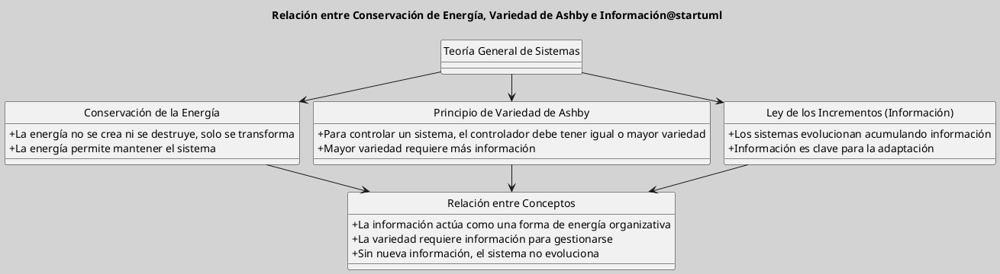

---
{"dg-publish":true,"permalink":"/050 Base de Conocimientos/200  Mi Zettelkasten/100 Docencia/Org1/2025/Clase 08 Elementos de un Sistema (Proceso de Conversión, Corriente de Salida, Mecanismos de Retroalimentación)/Zk Ley de la Conservación - Principio de Variedad de Ashby - Ley de los Incrementos (Información)/","tags":["digitalGarden"]}
---

## Ley de la Conservación - Principio de Variedad de Ashby - Ley de los Incrementos (Información)

### Características

| Ley de la Conservación de la Energía (Física)                                                                                                                                                                                                                                                | Principio de Variedad de Ashby                                                                                                                                                                                                                                                                                                                                                                                                                                                          | Ley de los Incrementos (Información)                                                                                                                                                                                                                                                                                                                                                                                          |
| :------------------------------------------------------------------------------------------------------------------------------------------------------------------------------------------------------------------------------------------------------------------------------------------- | :-------------------------------------------------------------------------------------------------------------------------------------------------------------------------------------------------------------------------------------------------------------------------------------------------------------------------------------------------------------------------------------------------------------------------------------------------------------------------------------- | :---------------------------------------------------------------------------------------------------------------------------------------------------------------------------------------------------------------------------------------------------------------------------------------------------------------------------------------------------------------------------------------------------------------------------- |
| - En sistemas físicos, establece que la energía no se crea ni se destruye, solo se transforma.  - En la TGS, puede interpretarse como la **conservación de recursos** o la **estabilidad de los sistemas cerrados**, donde cualquier cambio en un subsistema debe compensarse en otro. | - Dice que para controlar un sistema, el controlador debe tener al menos tanta variedad como el sistema controlado.  - En términos de información, implica que **un sistema con mayor cantidad de estados posibles** (más variedad) necesita **más información para ser controlado**.  - Relacionado con la conservación de la energía, podríamos verlo como la necesidad de distribuir la energía de procesamiento/control para mantener el equilibrio dentro del sistema. | Plantea que **todo sistema que crece o evoluciona lo hace mediante la acumulación de información**. 	 - Relacionado con Ashby, significa que un sistema necesita **más variedad** para procesar más información y adaptarse a cambios. 	 - En términos de conservación, podríamos pensar que la "energía" del sistema es la información acumulada: si no se adquiere nueva información, el sistema no evoluciona. |

### **Relación entre los tres conceptos**

- **Energía e información están relacionadas**: la información en un sistema puede entenderse como una forma de "energía organizativa", ya que permite el control y la adaptación.
    
- **Variedad de Ashby y la Ley de Incrementos**: A mayor variedad en un sistema, más información se necesita para gestionarlo, y esta información se acumula con el tiempo.
    
- **Conservación vs. Incremento**: Mientras que la energía se conserva, la información no necesariamente se "conserva", sino que crece o se degrada (como en la entropía de la información).

**Figura**
_Relación entre Conservación de Energía, Variedad de Ashby e Información_

Podemos decir que la **TGS permite integrar estos conceptos**:
- La energía proporciona la capacidad de actuar.
- La variedad define la capacidad de controlar.
- La información es el mecanismo que permite la adaptación y el crecimiento del sistema.

