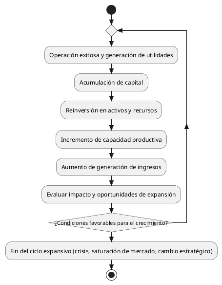
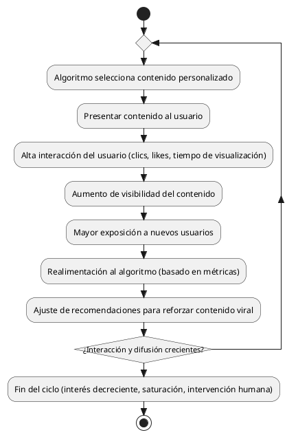

---
{"dg-publish":true,"permalink":"/050 Base de Conocimientos/200  Mi Zettelkasten/100 Docencia/Org1/2025/Clase 08 Elementos de un Sistema (Proceso de Conversión, Corriente de Salida, Mecanismos de Retroalimentación)/Zk Sistemas (Mecanismos de Retroalimentación Positiva o Morfogénesis)/","tags":["digitalGarden","retroalimentación"]}
---

## Retroalimentación Positiva (Morfogénesis)

La [[050 Base de Conocimientos/200  Mi Zettelkasten/100 Docencia/Org1/2025/Clase 08 Elementos de un Sistema (Proceso de Conversión, Corriente de Salida, Mecanismos de Retroalimentación)/Zk Sistemas (Mecanismos de Retroalimentación)\|retroalimentación]] **positiva** es un mecanismo que fomenta el crecimiento y el cambio al amplificar las desviaciones. Este tipo de retroalimentación puede llevar a un aumento en la complejidad o tamaño del sistema [[050 Base de Conocimientos/900 Biblioteca/Zk Lit (García, 2020) Teoría y Ejercicios Prácticos de Dinámica de Sistemas\|(García, 2020)]]. Este concepto está relacionado con la [[050 Base de Conocimientos/200  Mi Zettelkasten/040 Teoría General de Sistemas (TGS)/Zk Dinámica de Sistemas\|dinámica de sistemas]] con los [[050 Base de Conocimientos/200  Mi Zettelkasten/100 Docencia/Org1/2025/Clase 04 Dinámica de Sistemas/Zk Bucle de Refuerzo (Bucle Positivo)\|bucles de refuerzo positivo]].

### Ejemplos

- El crecimiento empresarial puede conceptualizarse como un sistema de retroalimentación positiva, donde el éxito operativo y financiero genera un ciclo de expansión. La acumulación de capital, producto de utilidades, permite la reinversión en activos y recursos, lo que a su vez incrementa la capacidad productiva y la generación de ingresos. Este fenómeno, caracterizado por la amplificación de resultados positivos, es un principio fundamental en la dinámica del desarrollo organizacional ([Aguilera Castro y Puerto Becerra, 2012=](https://www.redalyc.org/pdf/646/64623932002.pdf?utm_source=chatgpt.com)).

**Figura**
_Morfogénesis Empresarial (Retroalimentación Positiva)_

_Nota:_ Elaboración propia en base al ejemplo.

---
- En el ámbito de las ciencias de la computación, un ejemplo paradigmático de retroalimentación positiva se manifiesta en la dinámica de los algoritmos de recomendación en plataformas digitales. Estos sistemas, diseñados para personalizar la experiencia del usuario, exhiben un comportamiento autoamplificador: la presentación de contenido que genera alta interacción induce a una mayor visibilidad, lo cual, a su vez, incrementa la interacción. Este ciclo iterativo, donde la salida del sistema (visibilidad) realimenta la entrada (algoritmo), conduce a la viralización de contenido y a la formación de tendencias digitales, con implicaciones significativas en el comportamiento del usuario y la difusión de información ([Pérez Colomé, 2024](https://elpais.com/tecnologia/2024-11-19/alan-mislove-investigador-hay-empresas-tecnologicas-con-una-influencia-alucinante-sobre-como-hablamos-y-pensamos.html?utm_source=chatgpt.com).)

**Figura**
_Retroalimentación Positiva en Algoritmos de Recomendación_

_Nota:_ Elaboración propia en base al ejemplo.