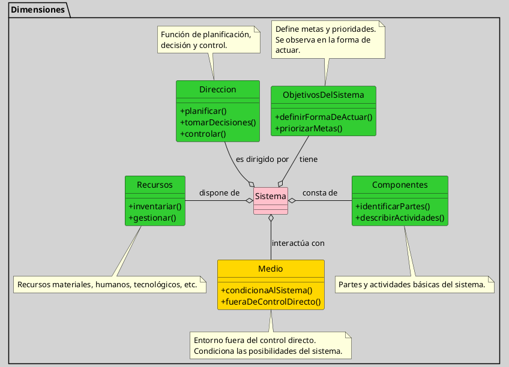

---
{"dg-publish":true,"permalink":"/050 Base de Conocimientos/200  Mi Zettelkasten/100 Docencia/Org1/2025/Clase 10 Definición de un Sistema/Zk Definición de un Sistema (Churchman)/","tags":["digitalGarden","churchman"]}
---

## Definición de un Sistema (Churchman)

Un sistema, desde el enfoque de [[050 Base de Conocimientos/900 Biblioteca/ZK Lit (Churchman, 1987) El Enfoque de Sistemas\|Churchman (1987)]] y según la interpretación de [[050 Base de Conocimientos/900 Biblioteca/Zk Lit (Johansen Bertoglio, 2013) Introducción a la Teoría General de Sistemas\|Johansen (2013)]], se entiende como un conjunto de partes coordinadas que buscan alcanzar ciertos objetivos.

Para definir o analizar un sistema, especialmente en el ámbito social o empresarial, desde la perspectiva de un investigador científico, este debe observar el todo y precisar cuidadosamente de qué está hablando, evitando caer en una visión fragmentada. Esta definición implica no solo identificar los [[050 Base de Conocimientos/200  Mi Zettelkasten/100 Docencia/Org1/2025/Clase 07 Elementos de un Sistema (Corriente de Entrada)/Zk Sistemas (Elementos)\|elementos]], sino comprender cómo se relacionan y contribuyen al propósito común del sistema.

### El Análisis de Sistemas Complejos

En el libro The Systems Approach (1969) y su traducción El Enfoque de Sistemas, [[050 Base de Conocimientos/900 Biblioteca/ZK Lit (Churchman, 1987) El Enfoque de Sistemas\|Churchman (1987)]] propone que el análisis para la compresión y conocimiento de un sistema requiere atender cinco dimensiones fundamentales: 

**Figura**
_Dimensiones de Análisis de Sistemas Complejos según Churchman_

_Nota_: Figura de elaboración propia, basada en [[050 Base de Conocimientos/900 Biblioteca/ZK Lit (Churchman, 1987) El Enfoque de Sistemas\|Churchman (1987)]] y [[050 Base de Conocimientos/900 Biblioteca/Zk Lit (Johansen Bertoglio, 2013) Introducción a la Teoría General de Sistemas\|Johansen (2013)]].

#### Dimensiones de Análisis
1. [[050 Base de Conocimientos/200  Mi Zettelkasten/100 Docencia/Org1/2025/Clase 10 Definición de un Sistema/Zk Definición de un Sistema (Churchman, Los Objetivos del Sistema Total)\|Los objetivos del sistema total]], concretamente su forma de actuar ante situaciones.
2. [[050 Base de Conocimientos/200  Mi Zettelkasten/100 Docencia/Org1/2025/Clase 10 Definición de un Sistema/Zk Definición de un Sistema (Churchman, El Medio en el que Opera (Vive) el Sistema)\|El Medio en el que Opera (vive) el Sistema]], entendido como aquello que está fuera del control directo del sistema pero que lo condiciona).
3. [[050 Base de Conocimientos/200  Mi Zettelkasten/100 Docencia/Org1/2025/Clase 10 Definición de un Sistema/Zk Definición de un Sistema (Churchman, Los Recursos Internos del Sistema)\|Los Recursos Internos Disponibles]].
4. [[050 Base de Conocimientos/200  Mi Zettelkasten/100 Docencia/Org1/2025/Clase 10 Definición de un Sistema/Zk Definición de un Sistema (Churchman, Los Componentes o Partes del Sistemas y sus Actividades)\|Los Componentes o Partes del Sistema y sus Actividades]].
5. [[050 Base de Conocimientos/200  Mi Zettelkasten/100 Docencia/Org1/2025/Clase 10 Definición de un Sistema/Zk Definición de un Sistema (Churchman, La Dirección o Administración del Sistema)\|La Dirección o Administración del Sistema]].

### ¿Qué Implica Definir un Sistema?

Definir un sistema implica delimitar sus fronteras, identificar sus objetivos reales (más allá de las declaraciones formales), distinguir entre entorno y recursos, y comprender la estructura funcional de sus componentes, todo ello bajo una lógica de revisión constante para captar la complejidad y dinámica propias de los sistemas sociales y organizacionales ([[050 Base de Conocimientos/900 Biblioteca/ZK Lit (Churchman, 1987) El Enfoque de Sistemas\|Churchman, 1987]]; [[050 Base de Conocimientos/900 Biblioteca/Zk Lit (Johansen Bertoglio, 2013) Introducción a la Teoría General de Sistemas\|Johansen Bertoglio, 2013]]).
