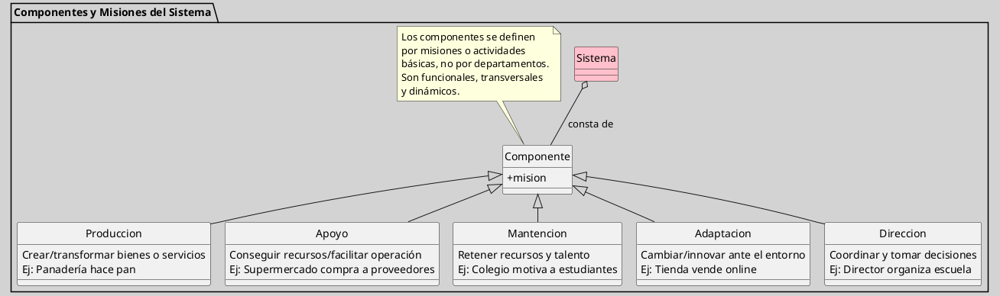

---
{"dg-publish":true,"permalink":"/050 Base de Conocimientos/200  Mi Zettelkasten/100 Docencia/Org1/2025/Clase 10 Definición de un Sistema/Zk Definición de un Sistema (Churchman, Los Componentes o Partes del Sistemas y sus Actividades)/","tags":["digitalGarden","churchman"]}
---

## Los Componentes o Partes del Sistemas y sus Actividades)

Los componentes de un sistema, según [[050 Base de Conocimientos/900 Biblioteca/ZK Lit (Churchman, 1987) El Enfoque de Sistemas\|Churchman (1987)]] y [[050 Base de Conocimientos/900 Biblioteca/Zk Lit (Johansen Bertoglio, 2013) Introducción a la Teoría General de Sistemas\|Johansen (2013)]], no se definen por estructuras administrativas tradicionales (como departamentos o divisiones), sino por las **misiones o actividades básicas** que contribuyen directamente a los objetivos del sistema total. Estos componentes son [[050 Base de Conocimientos/200  Mi Zettelkasten/100 Docencia/Org1/2025/Clase 05 Sistemas, Subsistemas, Suprasistemas/Zk !MOC Sistemas, Subsistemas y Suprasistemas\|subsistemas]] [[050 Base de Conocimientos/200  Mi Zettelkasten/100 Docencia/Org1/2025/Clase 03 Sinergia y Recursividad/Zk Sinergia en la Teoría General de Sistemas\|interdependientes]] cuya identificación requiere un **análisis funcional**, no jerárquico.

### Características
Siguiendo a [[050 Base de Conocimientos/900 Biblioteca/Zk Lit (Johansen Bertoglio, 2013) Introducción a la Teoría General de Sistemas\|Johansen (2013)]], son características de los componentes:

| Característica      | Explicación                                                                                                              |
| ------------------- | ------------------------------------------------------------------------------------------------------------------------ |
| Basados en misiones | Se agrupan según tareas específicas (ejemplo: innovación, experiencia de usuario, sostenibilidad).                       |
| Transversales       | Pueden abarcar múltiples áreas tradicionales (ejemplo: marketing y desarrollo en una misión de lanzamiento de producto). |
| Dinámicos           | Se reconfiguran según las necesidades del sistema (ejemplo: equipos temporales en startups para proyectos ágiles).       |

### Problemas con la Visión Tradicional

| Problema                                             | Ejemplos                                                                                                                                                          |
| ---------------------------------------------------- | ----------------------------------------------------------------------------------------------------------------------------------------------------------------- |
| [[Zk Silos Oganizacionales\|Silos organizacionales]] | En una empresa de streaming, el departamento de contenido puede ignorar las limitaciones técnicas de desarrollo, generando conflictos en la calidad del servicio. |
| Identificación errónea                               | En universidades, los "departamentos de investigación" no siempre incluyen a docentes que publican artículos, aunque contribuyan a la misión académica.           |

## Las Misiones Esenciales para la Supervivencia del Sistema 

Según Katz y Kahn, mencionados en [[050 Base de Conocimientos/900 Biblioteca/Zk Lit (Johansen Bertoglio, 2013) Introducción a la Teoría General de Sistemas\|Johansen (2013)]], las misiones esenciales son:

| Misión de  | Explicación                                                                                                                       | Ejemplo                                                                                           |
| ---------- | --------------------------------------------------------------------------------------------------------------------------------- | ------------------------------------------------------------------------------------------------- |
| Producción | Es la función de crear o transformar algo útil a partir de recursos. Es lo que hace que el sistema cumpla su propósito principal. | Una panadería que convierte harina, levadira y agua en pan para vender a sus clientes.            |
| Apoyo      | Consiste en conseguir lo que el sistema necesita para funcionar, o en facilitar que lo producido llegue a quien lo necesita.      | Un supermercado que compra productos a proveedores y los pone a disposición de los clientes.      |
| Mantención | Son las acciones para que las personas y recursos importantes sigan siendo parte del sistema y estén en buenas condiciones.       | Un colegio que organiza actividades para que los estudiantes se sientan motivados y no abandonen. |
| Adaptación | Es la capacidad de cambiar o innovar para responder a situaciones nuevas o problemas del entorno.                                 | Una tienda de ropa que comienza a vender por internet cuando bajan las ventas presenciales.       |
| Dirección  | Es la función de tomar decisiones, coordinar y guiar al sistema para que logre sus objetivos y funcione bien.                     | El director de una escuela que organiza horarios, asigna profesores y resuelve problemas.         |

Identificar componentes por misiones, no por estructuras rígidas, permite una visión holística del sistema.  [[050 Base de Conocimientos/900 Biblioteca/ZK Lit (Churchman, 1987) El Enfoque de Sistemas\|Churchman (1987)]] enfatiza que esta aproximación evita la fragmentación y facilita la medición real de contribuciones al objetivo global, especialmente en entornos complejos como empresas tech o gobiernos digitales.

**Figura**
_Msiones de los Componentes_

_Nota_: Figura de elaboración propia, basada en [[050 Base de Conocimientos/900 Biblioteca/ZK Lit (Churchman, 1987) El Enfoque de Sistemas\|Churchman (1987)]] y [[050 Base de Conocimientos/900 Biblioteca/Zk Lit (Johansen Bertoglio, 2013) Introducción a la Teoría General de Sistemas\|Johansen (2013)]].

