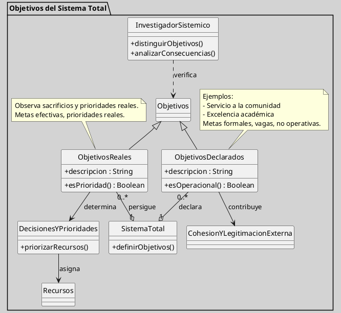

---
{"dg-publish":true,"permalink":"/050 Base de Conocimientos/200  Mi Zettelkasten/100 Docencia/Org1/2025/Clase 10 Definición de un Sistema/Zk Definición de un Sistema (Churchman, Los Objetivos del Sistema Total)/","tags":["digitalGarden","churchman"]}
---

## Los Objetivos del Sistema Total

**Figura**
_Objetivos del Sistema Total_

_Nota_: Figura de elaboración propia, basada en [[050 Base de Conocimientos/900 Biblioteca/ZK Lit (Churchman, 1987) El Enfoque de Sistemas\|Churchman (1987)]] y [[050 Base de Conocimientos/900 Biblioteca/Zk Lit (Johansen Bertoglio, 2013) Introducción a la Teoría General de Sistemas\|Johansen (2013)]].

Para analizar, definir o estudiar un sistema desde la perspectiva de [[050 Base de Conocimientos/900 Biblioteca/ZK Lit (Churchman, 1987) El Enfoque de Sistemas\|Churchman (1987)]], mencionada en [[050 Base de Conocimientos/900 Biblioteca/Zk Lit (Johansen Bertoglio, 2013) Introducción a la Teoría General de Sistemas\|Johansen (2013)]], es fundamental identificar los objetivos del sistema total, entendidos como las metas o finalidades que orientan y justifican su existencia. Sin embargo, definir estos objetivos no es sencillo: frecuentemente, las declaraciones formales de objetivos, como: “servicio a la comunidad” o “excelencia académica”, funcionan más como mecanismos de cohesión interna y legitimación externa que como guías operativas reales. Estas metas, denominadas “no operacionales”, suelen ser vagas y poco útiles para el análisis sistémico riguroso.

La tarea del investigador sistémico, entonces, es distinguir entre los [[objetivos declarados\|objetivos declarados]] y los [[050 Base de Conocimientos/200  Mi Zettelkasten/100 Docencia/Org1/2025/Clase 10 Definición de un Sistema/Zk Definición de un Sistema (Churchman, Los Objetivos del Sistema Total, Objetivos Reales)\|objetivos reales u operacionales]]. Para ello, [[050 Base de Conocimientos/900 Biblioteca/ZK Lit (Churchman, 1987) El Enfoque de Sistemas\|Churchman (1987)]] propone observar si el sistema está dispuesto a sacrificar otros fines para alcanzar ciertos resultados específicos: los objetivos reales son aquellos por los que el sistema efectivamente toma decisiones y prioriza recursos, aunque no siempre coincidan con los valores públicamente enunciados.

Identificar los objetivos del sistema total requiere una mirada crítica, persistente y reflexiva, capaz de distinguir entre las declaraciones formales y las verdaderas prioridades operativas, y de considerar tanto las consecuencias directas como las indirectas de las acciones del sistema ([[050 Base de Conocimientos/900 Biblioteca/ZK Lit (Churchman, 1987) El Enfoque de Sistemas\|Churchman, 1987]]; [[050 Base de Conocimientos/900 Biblioteca/Zk Lit (Johansen Bertoglio, 2013) Introducción a la Teoría General de Sistemas\|Johansen Bertoglio, 2013]]).