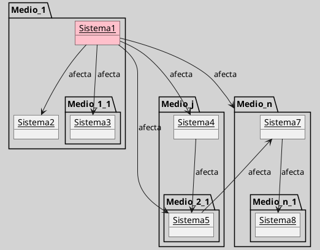

---
{"dg-publish":true,"permalink":"/050 Base de Conocimientos/200  Mi Zettelkasten/100 Docencia/Org1/2025/Clase 13 Principio de Organicidad/Zk El Efecto Mariposa/","tags":["digitalGarden"]}
---

## El Efecto Mariposa

>[!Abstract] 
>... una acción aparentemente insignificante en un lugar y momento determinados puede desencadenar efectos significativos en otros contextos y tiempos

El **efecto mariposa** ilustra cómo **pequeñas variaciones en las condiciones iniciales de un sistema dinámico no lineal pueden generar grandes e impredecibles consecuencias**. Es decir, una acción aparentemente insignificante en un lugar y momento determinados puede desencadenar efectos significativos en otros contextos y tiempos ([[050 Base de Conocimientos/900 Biblioteca/Zk Lit (García, 2024) Ciencias de la Complejidad - Teoría General de Sistemas, Pensamiento Sistémico y sus Aplicaciones Prácticas en las Ciencias Económicas, Ambientales y Sociales\|García, 2024, cap. 2]]; [[050 Base de Conocimientos/900 Biblioteca/Zk Lit (Ossa Ossa, 2016) Teoría General de Sistemas -  Conceptos y Aplicaciones\|Ossa Ossa, 2016, p. 229]]).

Según [[050 Base de Conocimientos/900 Biblioteca/Zk Lit (García, 2024) Ciencias de la Complejidad - Teoría General de Sistemas, Pensamiento Sistémico y sus Aplicaciones Prácticas en las Ciencias Económicas, Ambientales y Sociales\|García (2024, cap. 2)]] y [[050 Base de Conocimientos/900 Biblioteca/Zk Lit (Ossa Ossa, 2016) Teoría General de Sistemas -  Conceptos y Aplicaciones\|Ossa Ossa  (2016, p. 229)]], el término fue acuñado por el meteorólogo y matemático [Edward Lorenz (1963)](https://es.wikipedia.org/wiki/Edward_Lorenz), quien evidenció las dificultades de predecir con precisión el comportamiento de sistemas complejos: naturales, sociales o artificiales. De ahí surge la célebre frase: _"El tenue aleteo de una mariposa en Hong Kong puede convertirse en el tornado que devastará Kansas"._

Figura
_Representación Conceptual del Efecto Mariposa con un Diagrama de Clases_

_Nota_: Gráfico de elaboración propia a partir la definición.