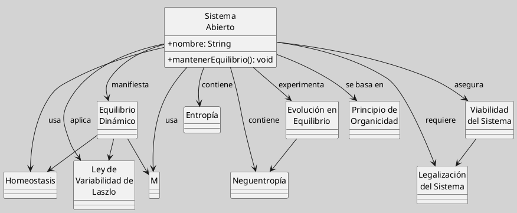

---
{"dg-publish":true,"permalink":"/050 Base de Conocimientos/200  Mi Zettelkasten/100 Docencia/Org1/2025/Clase 13 Principio de Organicidad/Zk Principio de Organicidad (Uniendo Conceptos)/","tags":["digitalGarden"]}
---

## Uniendo Conceptos del Principio de Organicidad

###  Equilibrio Dinámico en Sistemas Abiertos

- Los [[050 Base de Conocimientos/200  Mi Zettelkasten/100 Docencia/Org1/2025/Clase 06 Sistemas, Fundamentos, Propiedades, Principios Básicos/Zk Sistemas Abiertos\|sistemas abiertos]] mantienen un equilibrio dinámico, no estático, gracias a la constante interacción con su entorno.
    
- Este [[050 Base de Conocimientos/200  Mi Zettelkasten/100 Docencia/Org1/2025/Clase 13 Principio de Organicidad/Zk Principio de Organicidad (Equilibrio Dinámico de Sistemas)\|equilibrio]] se logra mediante la importación de energía e información ([[050 Base de Conocimientos/200  Mi Zettelkasten/100 Docencia/Org1/2025/Clase 12 Entropía y Neguentropía/Zk Neguentropía (Entropía Negativa)\|neguentropía]]) que compensa la tendencia natural al desorden ([[050 Base de Conocimientos/200  Mi Zettelkasten/100 Docencia/Org1/2025/Clase 06 Sistemas, Fundamentos, Propiedades, Principios Básicos/Zk Entropía\|entropía]]).
    
- La estabilidad sistémica no implica inmovilidad, sino fluctuaciones controladas dentro de márgenes viables.

----
### Entropía y Neguentropía

- La [[050 Base de Conocimientos/200  Mi Zettelkasten/100 Docencia/Org1/2025/Clase 06 Sistemas, Fundamentos, Propiedades, Principios Básicos/Zk Entropía\|entropía]] es la tendencia natural de los [[050 Base de Conocimientos/200  Mi Zettelkasten/100 Docencia/Org1/2025/Clase 06 Sistemas, Fundamentos, Propiedades, Principios Básicos/Zk Sistemas Cerrados\|sistemas cerrados]] hacia el desorden y la desorganización.
    
- Los [[050 Base de Conocimientos/200  Mi Zettelkasten/100 Docencia/Org1/2025/Clase 06 Sistemas, Fundamentos, Propiedades, Principios Básicos/Zk Sistemas Abiertos\|sistemas abiertos]] pueden contrarrestar la [[050 Base de Conocimientos/200  Mi Zettelkasten/100 Docencia/Org1/2025/Clase 06 Sistemas, Fundamentos, Propiedades, Principios Básicos/Zk Entropía\|entropía]] importando neguentropía (orden, organización, energía útil) del entorno.
    
- La [[050 Base de Conocimientos/200  Mi Zettelkasten/100 Docencia/Org1/2025/Clase 12 Entropía y Neguentropía/Zk Neguentropía (Entropía Negativa)\|neguentropía]] es esencial para la subsistencia y evolución de los sistemas vivos y sociales.

---
### Homeostasis y Morfogénesis

- La [[050 Base de Conocimientos/200  Mi Zettelkasten/100 Docencia/Org1/2025/Clase 06 Sistemas, Fundamentos, Propiedades, Principios Básicos/Zk Homeostasis\|homeostasis]] es el mecanismo de autorregulación que permite mantener variables internas dentro de límites viables frente a perturbaciones externas.
    
- La [[050 Base de Conocimientos/200  Mi Zettelkasten/100 Docencia/Org1/2025/Clase 08 Elementos de un Sistema (Proceso de Conversión, Corriente de Salida, Mecanismos de Retroalimentación)/Zk Sistemas (Mecanismos de Retroalimentación Positiva o Morfogénesis)\|morfogénesis]] implica cambios estructurales que permiten la adaptación y evolución del sistema ante cambios más profundos o persistentes del entorno.

----
### Principio de Organicidad

- Existe una tendencia natural en los [[050 Base de Conocimientos/200  Mi Zettelkasten/100 Docencia/Org1/2025/Clase 06 Sistemas, Fundamentos, Propiedades, Principios Básicos/Zk Sistemas Abiertos\|sistemas abiertos]] hacia la organización y la complejidad, lo que permite su [[050 Base de Conocimientos/200  Mi Zettelkasten/100 Docencia/Org1/2025/Clase 06 Sistemas, Fundamentos, Propiedades, Principios Básicos/Zk Sistemas (Supervivencia)\|supervivencia]] y desarrollo a largo plazo.
    
- El [[050 Base de Conocimientos/200  Mi Zettelkasten/100 Docencia/Org1/2025/Clase 13 Principio de Organicidad/Zk Principio de Organicidad (Equilibrio Dinámico de Sistemas)\|principio de organicidad]] se manifiesta en la capacidad de los sistemas para autoorganizarse y evolucionar, a pesar de la tendencia [[050 Base de Conocimientos/200  Mi Zettelkasten/100 Docencia/Org1/2025/Clase 06 Sistemas, Fundamentos, Propiedades, Principios Básicos/Zk Entropía\|entrópica]] al caos.

----
### Ley de la Variabilidad de Laszlo

- La estabilidad de un sistema no se basa en la ausencia de cambio, sino en la capacidad de fluctuar dentro de márgenes que garantizan la supervivencia.
    
- La variabilidad interna (ajustes y adaptaciones) permite a los sistemas responder a la variabilidad externa (cambios del entorno) sin perder su identidad básica.

----
### Compatibilización de Entropía y Neguentropía

- Aunque la [[050 Base de Conocimientos/200  Mi Zettelkasten/100 Docencia/Org1/2025/Clase 06 Sistemas, Fundamentos, Propiedades, Principios Básicos/Zk Entropía\|entropía]] tiende a desorganizar el sistema, la [[050 Base de Conocimientos/200  Mi Zettelkasten/100 Docencia/Org1/2025/Clase 12 Entropía y Neguentropía/Zk Neguentropía (Entropía Negativa)\|neguentropía]] (importada del entorno) permite combatir y superar esa tendencia.
    
- La viabilidad del sistema depende de su capacidad para generar un excedente de energía ([[050 Base de Conocimientos/200  Mi Zettelkasten/100 Docencia/Org1/2025/Clase 12 Entropía y Neguentropía/Zk Neguentropía (Entropía Negativa)\|neguentropía]]) sobre la requerida para el proceso de transformación principal, destinándola a mantener y mejorar la organización interna y las relaciones con el entorno.

---
### Evolución en Equilibrio

- El equilibrio de los sistemas no es inerte, sino que implica la acumulación de pequeños cambios que, a largo plazo, producen transformaciones evolutivas.
    
- Los sistemas presentan fuerzas que resisten cambios bruscos y fuerzas que impulsan cambios lentos y evolutivos, permitiendo la adaptación progresiva.

---
### Legalización y Viabilidad

- La aceptación del sistema por su entorno (legalización) es fundamental para su [[050 Base de Conocimientos/200  Mi Zettelkasten/100 Docencia/Org1/2025/Clase 06 Sistemas, Fundamentos, Propiedades, Principios Básicos/Zk Sistemas (Supervivencia)\|supervivencia]].
    
- La viabilidad sistémica se basa en la capacidad de mantener el equilibrio dinámico, ajustando sus procesos internos y su relación con el entorno, y asegurando la coherencia entre sus objetivos, recursos y medios.

---
### Esquema Gráfico

Figura
_Esquema Gráfico de Conceptos_

