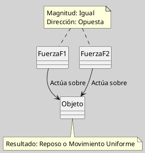
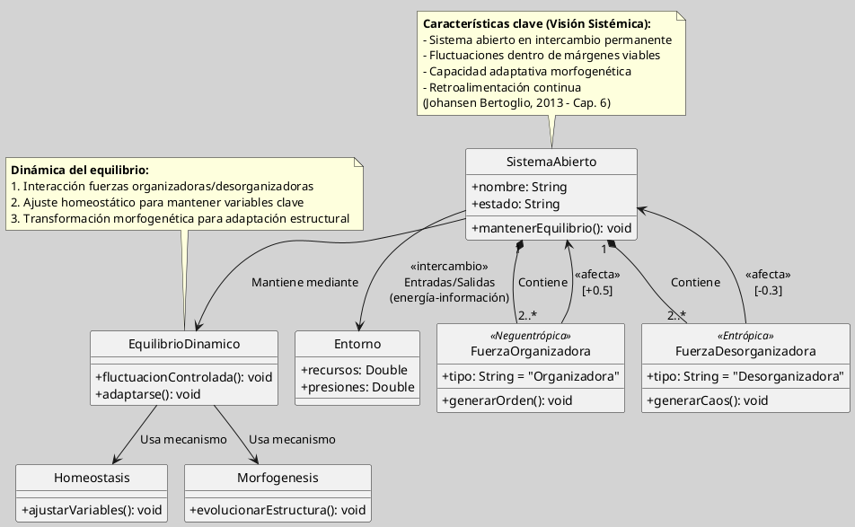

---
{"dg-publish":true,"permalink":"/050 Base de Conocimientos/200  Mi Zettelkasten/100 Docencia/Org1/2025/Clase 13 Principio de Organicidad/Zk Principio de Organicidad (Visión Newtoniana y Sistémica del Equilibrio)/","tags":["digitalGarden"]}
---

## Visión Newtoniana y Sistémica del Equilibrio

### Visión Newtoniana

La **visión newtoniana del equilibrio** se fundamenta en las leyes del movimiento de Isaac Newton y describe el equilibrio como un estado estático o estadístico, donde las fuerzas opuestas dentro de un sistema se compensan mutuamente. En este marco, un sistema permanece en reposo o en movimiento uniforme a menos que una fuerza externa actúe sobre él. El equilibrio resulta, entonces, de la acción y reacción de fuerzas iguales y opuestas, generando una apariencia de estabilidad global aunque en el interior del sistema existan múltiples movimientos y cambios [[050 Base de Conocimientos/900 Biblioteca/Zk Lit (Johansen Bertoglio, 2013) Introducción a la Teoría General de Sistemas\|(Johansen Bertoglio, 2013, cap. 6.2)]].

**Figura**
_Visión Newtoniana_

#### Características

| Característica                     |                                                                                                                                                                                                                                                                                                             |
| ---------------------------------- | ----------------------------------------------------------------------------------------------------------------------------------------------------------------------------------------------------------------------------------------------------------------------------------------------------------- |
| Equilibrio estático o estadístico  | Aunque las partes individuales del sistema pueden estar en constante movimiento o cambio, el sistema total mantiene condiciones promedio constantes a lo largo del tiempo. Ejemplo: en un estanque de gas, las moléculas se mueven caóticamente, pero la presión y temperatura promedio permanecen estables |
| Compensación de fuerzas            | El equilibrio se logra porque las acciones y reacciones internas se cancelan entre sí, siguiendo el principio de acción-reacción de Newton.                                                                                                                                                                 |
| Adecuado para sistemas cerrados    | Esta visión es útil para describir sistemas físicos cerrados, donde no hay intercambio significativo de energía o materia con el entorno.                                                                                                                                                                   |
| Limitación para sistemas complejos | El equilibrio newtoniano no explica adecuadamente la dinámica de sistemas abiertos, vivos o sociales, donde la interacción con el entorno y la autoorganización son fundamentales.                                                                                                                          |
*Fuente*: [[050 Base de Conocimientos/900 Biblioteca/Zk Lit (Johansen Bertoglio, 2013) Introducción a la Teoría General de Sistemas\|(Johansen Bertoglio, 2013, p. 112-113)]].

### Visión Sistémica

La **visión sistémica del equilibrio**, según [[050 Base de Conocimientos/900 Biblioteca/Zk Lit (Johansen Bertoglio, 2013) Introducción a la Teoría General de Sistemas\|Johansen Bertoglio (2013)]], concibe los sistemas como **entidades dinámicas y abiertas** que mantienen su viabilidad mediante intercambios energéticos-informativos con el entorno. A diferencia del [[#Visión Newtoniana|equilibrio estático newtoniano]], este enfoque enfatiza la **fluctuación controlada** entre fuerzas organizadoras (neguentrópicas) y desorganizadoras (entrópicas), permitiendo adaptación y evolución.

Mientras la [[#Visión Newtoniana|visión newtoniana]] considera el equilibrio como un estado fijo y recuperable tras perturbaciones, la [[050 Base de Conocimientos/200  Mi Zettelkasten/100 Docencia/Org1/2025/Clase 02 Introducción a la Teoría General de Sistemas/Zk Enfoque de la Teoría General de Sistemas\|Teoría General de Sistemas]] propone un [[050 Base de Conocimientos/200  Mi Zettelkasten/100 Docencia/Org1/2025/Clase 13 Principio de Organicidad/Zk Principio de Organicidad (Equilibrio Dinámico de Sistemas)\|equilibrio dinámico]], donde el [[050 Base de Conocimientos/200  Mi Zettelkasten/100 Docencia/Org1/2025/Clase 06 Sistemas, Fundamentos, Propiedades, Principios Básicos/Zk Sistemas Abiertos\|sistema]] se adapta y evoluciona en respuesta a cambios internos y externos.

**Figura**
*Visión Sistémica del Equilibrio*

### Comparación con la Visión Newtoniana vs Sistémica

| **Parámetro**    | **Visión Newtoniana**          | **Visión Sistémica**                         |
| ---------------- | ------------------------------ | -------------------------------------------- |
| **Equilibrio**   | Estático (acción-reacción)     | Dinámico (fluctuaciones en márgenes viables) |
| **Enfoque**      | Fuerzas externas restauradoras | Interacciones internas/externas              |
| **Ejemplo**      | Péndulo en reposo              | Empresa que innova ante crisis de mercado    |
| **Base teórica** | Leyes mecánicas                | Teoría de sistemas abiertos                  |

----
### Ejemplo

Una organización mantiene su **equilibrio dinámico** gracias a la interacción continua entre fuerzas organizadoras (neguentrópicas) y desorganizadoras (entrópicas), en línea con el principio de organicidad descrito por Johansen Bertoglio [[050 Base de Conocimientos/900 Biblioteca/Zk Lit (Johansen Bertoglio, 2013) Introducción a la Teoría General de Sistemas\|(Johansen Bertoglio, 2013, cap. 6)]].

#### Fuerzas organizadoras (neguentrópicas)

| Fuerzas             | Explicación                                                                                                                                                                                                                                          |
| ------------------- | ---------------------------------------------------------------------------------------------------------------------------------------------------------------------------------------------------------------------------------------------------- |
| Inversión en I+D    | La organización destina recursos a la investigación y desarrollo para innovar productos o procesos, generando nuevo conocimiento y aumentando su capacidad adaptativa. Esto incrementa el orden interno y la diferenciación frente a la competencia. |
| Capacitación        | La formación continua del personal mejora competencias, cohesiona equipos y refuerza la cultura organizacional, facilitando la adaptación a cambios del entorno.                                                                                     |
| Sistemas de Xalidad | La implementación de normas y procedimientos estandarizados reduce errores, mejora la eficiencia y asegura la satisfacción del cliente, contribuyendo a la estabilidad y sostenibilidad del sistema.                                                 |

#### Fuerzas desorganizadoras (entrópicas)

| Fuerzas                        | Explicación                                                                                                                                                    |
| ------------------------------ | -------------------------------------------------------------------------------------------------------------------------------------------------------------- |
| **Rotación de personal**       | La salida frecuente de empleados genera pérdida de conocimiento, ruptura de equipos y costos de adaptación, introduciendo desorden y vulnerabilidad.           |
| **Obsolescencia tecnológica**: | La falta de actualización de equipos o sistemas provoca ineficiencia, errores y pérdida de competitividad, incrementando el riesgo de desorganización interna. |

#### Dinámica Sistémica

El equilibrio dinámico se logra cuando las fuerzas organizadoras compensan o superan a las desorganizadoras. Si la organización invierte suficientemente en innovación, formación y calidad, puede absorber el impacto de la rotación o la obsolescencia, manteniendo su viabilidad y capacidad de adaptación [[050 Base de Conocimientos/900 Biblioteca/Zk Lit (Johansen Bertoglio, 2013) Introducción a la Teoría General de Sistemas\|(Johansen Bertoglio, 2013, cap. 6)]].
