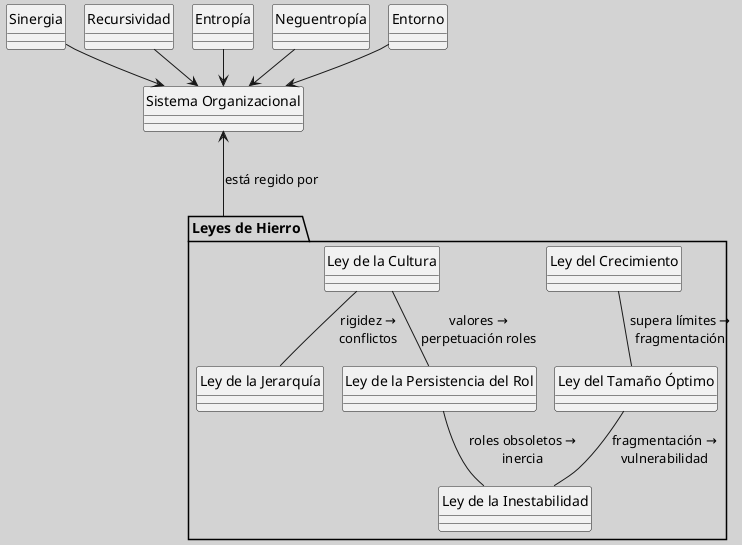

---
{"dg-publish":true,"permalink":"/050 Base de Conocimientos/200  Mi Zettelkasten/100 Docencia/Org1/2025/Clase 14 Leyes de Hierro de la Organización/Zk Leyes de Hierro de la Organización (Boulding) Esquema Gráfico/","tags":["digitalGarden"]}
---

## Leyes de Hierro de la Organización (Boulding) Esquema Gráfico

Este diagrama sintetiza las **interacciones dinámicas** entre las seis Leyes de Hierro de la Organización propuestas por Boulding y mencionadas en [[(Johansen Bertoglio, 1982) Anatomía de la Empresa - Una Teoría General de las Organizaciones Sociales. Limusa  Noriega.pdf|Johansen Bertoglio (1982)]]. Su estructura refleja la visión sistémica de las organizaciones como redes de retroalimentación interdependientes.

**Figura**
_Esquema Gráfico de las Leyes de Hierro de la Organización_

Nota: Elaboración Propia, basado en [[050 Base de Conocimientos/900 Biblioteca/Zk Lit (Johansen Bertoglio, 1982) Anatomía de la Empresa - Una Teoría General de las Organizaciones Sociales. Limusa  Noriega\|Johansen (1982)]].

### Interpretación del Esquema Gráfico

| Elemento                           | Explicación                                                                                                                                                                                                                                                                                                                                                                                                                                                                                                                                                                                                                                                                                                                                                                                                                                                                                                                                                                                                                                                               |
| ---------------------------------- | ------------------------------------------------------------------------------------------------------------------------------------------------------------------------------------------------------------------------------------------------------------------------------------------------------------------------------------------------------------------------------------------------------------------------------------------------------------------------------------------------------------------------------------------------------------------------------------------------------------------------------------------------------------------------------------------------------------------------------------------------------------------------------------------------------------------------------------------------------------------------------------------------------------------------------------------------------------------------------------------------------------------------------------------------------------------------- |
| Paquete de Leyes de Hierro         | Agrupa los seis principios fundamentales:  1a. [[050 Base de Conocimientos/200  Mi Zettelkasten/100 Docencia/Org1/2025/Clase 14 Leyes de Hierro de la Organización/Zk Leyes de Hierro de la Organización (Boulding) (Ley del Crecimiento)\|Ley del Crecimiento]]: Dinámica exponencial vs. límites logísticos.  2a. [[050 Base de Conocimientos/200  Mi Zettelkasten/100 Docencia/Org1/2025/Clase 14 Leyes de Hierro de la Organización/Zk Leyes de Hierro de la Organización (Boulding) (Ley de la Cultura)\|Ley de la Cultura]]: Resistencia a cambios en patrones internalizados.  3a. [[050 Base de Conocimientos/200  Mi Zettelkasten/100 Docencia/Org1/2025/Clase 14 Leyes de Hierro de la Organización/Zk Leyes de Hierro de la Organización (Boulding) (Ley del Tamaño Óptimo)\|Ley del Tamaño Óptimo]]: Umbral crítico de eficiencia organizacional.  4a. [[050 Base de Conocimientos/200  Mi Zettelkasten/100 Docencia/Org1/2025/Clase 14 Leyes de Hierro de la Organización/Zk Leyes de Hierro de la Organización (Boulding) (Ley de la Jerarquía)\|Ley de la Jerarquía]]: Distorsiones en estructuras de poder.  5a. [[050 Base de Conocimientos/200  Mi Zettelkasten/100 Docencia/Org1/2025/Clase 14 Leyes de Hierro de la Organización/Zk Leyes de Hierro de la Organización (Boulding) (Ley de la Inestabilidad)\|Ley de la Inestabilidad]]: Fragilidad por factores internos/externos.  6a. [[050 Base de Conocimientos/200  Mi Zettelkasten/100 Docencia/Org1/2025/Clase 14 Leyes de Hierro de la Organización/Zk Leyes de Hierro de la Organización (Boulding) (Ley de la Persistencia del Rol)\|Ley de la Persistencia del Rol]]: Rigidez en funciones institucionalizadas.                                                    |
| Relación entre las Leyes           | Las flechas indican **efectos sinérgicos**:      - El crecimiento descontrolado ([[050 Base de Conocimientos/200  Mi Zettelkasten/100 Docencia/Org1/2025/Clase 14 Leyes de Hierro de la Organización/Zk Leyes de Hierro de la Organización (Boulding) (Ley del Crecimiento)\|1a. Ley]]) acelera la pérdida de tamaño óptimo ([[050 Base de Conocimientos/200  Mi Zettelkasten/100 Docencia/Org1/2025/Clase 14 Leyes de Hierro de la Organización/Zk Leyes de Hierro de la Organización (Boulding) (Ley del Tamaño Óptimo)\|3a. Ley]]).          - La rigidez cultural ([[050 Base de Conocimientos/200  Mi Zettelkasten/100 Docencia/Org1/2025/Clase 14 Leyes de Hierro de la Organización/Zk Leyes de Hierro de la Organización (Boulding) (Ley de la Cultura)\|2a. Ley]]) potencia conflictos jerárquicos ([[050 Base de Conocimientos/200  Mi Zettelkasten/100 Docencia/Org1/2025/Clase 14 Leyes de Hierro de la Organización/Zk Leyes de Hierro de la Organización (Boulding) (Ley de la Jerarquía)\|4a. Ley]]).          - La fragmentación estructural ([[050 Base de Conocimientos/200  Mi Zettelkasten/100 Docencia/Org1/2025/Clase 14 Leyes de Hierro de la Organización/Zk Leyes de Hierro de la Organización (Boulding) (Ley del Tamaño Óptimo)\|3a. Ley]]) incrementa vulnerabilidad ([[050 Base de Conocimientos/200  Mi Zettelkasten/100 Docencia/Org1/2025/Clase 14 Leyes de Hierro de la Organización/Zk Leyes de Hierro de la Organización (Boulding) (Ley de la Inestabilidad)\|5a. Ley]]).          - Roles obsoletos ([[050 Base de Conocimientos/200  Mi Zettelkasten/100 Docencia/Org1/2025/Clase 14 Leyes de Hierro de la Organización/Zk Leyes de Hierro de la Organización (Boulding) (Ley de la Persistencia del Rol)\|6a. Ley]]) agravan la inestabilidad ([[050 Base de Conocimientos/200  Mi Zettelkasten/100 Docencia/Org1/2025/Clase 14 Leyes de Hierro de la Organización/Zk Leyes de Hierro de la Organización (Boulding) (Ley de la Inestabilidad)\|5a. Ley]]). |
| Conexión con Principios Sistémicos | - **Sinergia**: Emergencia de propiedades no predecibles desde partes aisladas. 	 - **Recursividad**: Jerarquía de sistemas dentro de sistemas . 	 - **Entropía/Neguentropía**: Tensión entre desorden y autoorganización . 	 - **Entorno**: Limitaciones y presiones contextuales sobre la organización.                                                                                                                                                                                                                                                                                                                                                                                                                                                                                                                                                                                                                                                                                                                                               |
_Nota_: Los sistemas organizacionales, operan en permanente puja entre las fuerzas [[050 Base de Conocimientos/200  Mi Zettelkasten/100 Docencia/Org1/2025/Clase 06 Sistemas, Fundamentos, Propiedades, Principios Básicos/Zk Entropía\|entrópicas]] y [[050 Base de Conocimientos/200  Mi Zettelkasten/100 Docencia/Org1/2025/Clase 12 Entropía y Neguentropía/Zk Neguentropía (Entropía Negativa)\|neguentrópicas]]. La [[050 Base de Conocimientos/200  Mi Zettelkasten/100 Docencia/Org1/2025/Clase 12 Entropía y Neguentropía/Zk Entropía y Neguentropía (Sistemas Viables)\|viabilidad organizacional]] depende del [[050 Base de Conocimientos/200  Mi Zettelkasten/100 Docencia/Org1/2025/Clase 13 Principio de Organicidad/Zk Principio de Organicidad (Equilibrio Dinámico de Sistemas)\|equilibrio dinámico]] entre estos [[050 Base de Conocimientos/200  Mi Zettelkasten/100 Docencia/Org1/2025/Clase 06 Sistemas, Fundamentos, Propiedades, Principios Básicos/Zk Entropía\|entropía]] y [[050 Base de Conocimientos/200  Mi Zettelkasten/100 Docencia/Org1/2025/Clase 12 Entropía y Neguentropía/Zk Neguentropía (Entropía Negativa)\|neguentropía]], donde las [[050 Base de Conocimientos/200  Mi Zettelkasten/100 Docencia/Org1/2025/Clase 14 Leyes de Hierro de la Organización/Zk Leyes de Hierro de la Organización (Boulding)\|Leyes de Hierro]] actúan como marcos reguladores que condicionan su trayectoria evolutiva.
