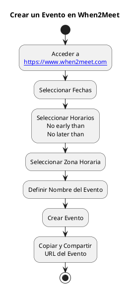

---
{"dg-publish":true,"permalink":"/050 Base de Conocimientos/200  Mi Zettelkasten/990 Varios/Zk When2Meet - Crear un Evento/","tags":["#when2meet","#reunión","#planificación"]}
---

## Crear un Evento
1. Ingresar al sitio [When2Meet]([https://www.when2meet.com/](https://www.when2meet.com/)).

3. Seleccionar fechas posibles para el evento, marcando en el calendario
4. Definir el rango horario del evento
5. Ingresar un nombre para su evento en el campo ==Event Name==. Ejemplo: Reunión de...
6. Hacer clic en ==Create Event==.
7. Compartir el enlace generado con los participantes (copiar la URL del navegador)

## Versión Gráfica

