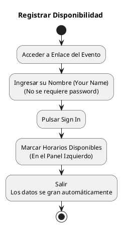

---
{"dg-publish":true,"permalink":"/050 Base de Conocimientos/200  Mi Zettelkasten/990 Varios/Zk When2Meet - Registrar Disponibilidad/","tags":["when2meet","reunión","planificación"]}
---

## Registrar Disponibilidad
1. Abrir el enlace del evento [URL]().
2. En la página del evento:
    - Ingrese su nombre en el campo **Your Name**.
    - No se requiere contraseña.

3. Haga clic en ==Sign In==.
4. Una vez que haya ingresado, en el panel izquierdo (cuadrícula rosa):
    - Haga clic y arrastre para marcar sus horarios disponibles.
    - Las áreas seleccionadas cambiarán de color.
    - Es posible registrar rangos no contiguos.

5. Para desmarcar, haga clic nuevamente sobre las áreas seleccionadas.
6. Los cambios se guardan automáticamente.
## Versión Gráfica

