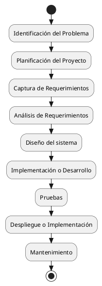

---
{"dg-publish":true,"permalink":"/060 Desarrollos/UI-UML Specification Framework (UUSF)/01 Overview/Zk Ciclo de Vida del Desarrollo del Software SDLC (Gráfico Simplificado)/","tags":["digitalGarden","sdlc"]}
---

## Ciclo de Vida del Desarrollo del Software SDLC (Gráfico Simplificado)

**Figura**
_Ciclo de Vida de Desarrollo del Software (Fases)_

_Fuente_: [[050 Base de Conocimientos/900 Biblioteca/Zk Lit (Pressman, 2013) Ingeniería del Software - Un Enfoque Práctico (Séptima edición). McGraw-Hill Education\|(Pressman, 2013)]], [[050 Base de Conocimientos/900 Biblioteca/Zk Lit (Weitzenfeld, 2005) Ingenieria de software orientada a objetos con UML, Java e Internet\|(Weitzenfeld, 2005)]]
