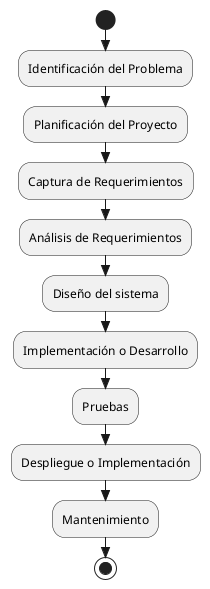

---
{"dg-publish":true,"permalink":"/060 Desarrollos/UI-UML Specification Framework (UUSF)/01 Overview/Zk SDLC - Ciclo de Vida del Desarrollo del Software (Simplificado)/","tags":["digitalGarden","sdlc"]}
---

## SDLC - Ciclo de Vida del Desarrollo del Software (Simplificado)

{ #0fd521}

